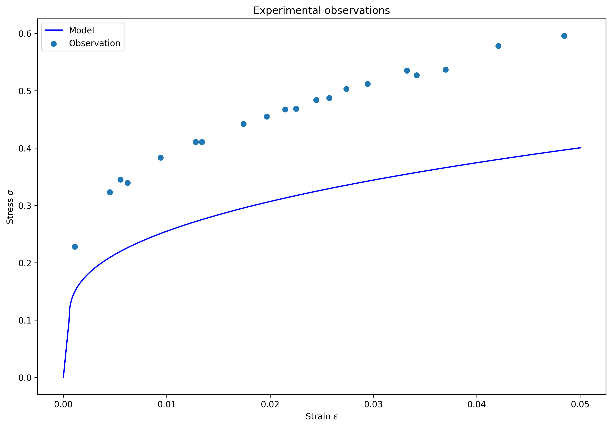

# Inverse problem challenge

The below figure illustrates the default linear elastic-nonlinear hardening model and a given set of 20 experimental observations. It is clear that the agreement between the model and experimental observations is poor.

Estimate the model parameters to improve the agreement between the model and the observations. The model is defined by four parameters:

- $E$: Young's modulus
- $\sigma_y$: yield stress
- $H$: plastic hardening modulus
- $n$: plastic hardening modulus exponent